<!-- ============================  HEADER  ============================ -->

  

  

  
  
  
  

<!-- ============================  ABOUT  ============================ -->
## 👋 About me

I'm a **Data Scientist** who works across the whole lifecycle: understanding the data, engineering features that actually move the metric, building and evaluating models, then taking them to production with **MLOps** and extending them with **Generative AI**. I've also trained **20,000+ working professionals and freshers** in data science, so I care about work that is reproducible, measured and easy for someone else to pick up.

- 📊 **Data Science & ML:** statistics, feature engineering, leakage-proof pipelines, calibrated models evaluated in business terms
- ⚙️ **MLOps:** DVC, MLflow tracking & registry, Prefect orchestration, FastAPI + Docker serving, CI/CD with GitHub Actions, drift monitoring
- 🤖 **Generative AI:** transformers, embeddings, LangChain, RAG and agentic apps
- 🔭 **Right now:** writing a 42-article *Generative AI Engineer* course and a hands-on LangChain apps series
- 📍 New Delhi, India · 🎓 Post Graduate in AI

<!-- ============================  STACK  ============================ -->
## 🧰 Tech stack

  

  
  
  
  
  
  
  
  
  
  
  
  
  

<!-- ============================  HOW I WORK  ============================ -->
## ⚙️ How I take a model to production

<picture>
  <source media="(prefers-color-scheme: dark)" srcset="./assets/ml-pipeline-dark.svg">
  
</picture>

<!-- ============================  PROJECTS  ============================ -->
## 🚀 Featured projects

<table>
<tr>
<td width="50%" valign="top">
<h3><a href="https://github.com/shikharkumar13/Lending-Club-Loan-Default-Project-MLOps">🏦 Lending Club: Profit-Based Loan Funding</a></h3>

Predicts default on <b>2.26M</b> Lending Club loans using only what an investor sees at listing time, then funds a loan only when its <b>expected profit</b> justifies it. Time-based validation, calibrated LightGBM, a fairness audit, FastAPI + Docker serving and <b>36 months of replayed drift monitoring</b> with a tested retraining gate.

<b>Result:</b> +7.35¢ per dollar vs +6.55¢ funding everything · 118 tests in CI · <a href="https://shikharkumar13.github.io/Lending-Club-Loan-Default-Project-MLOps/">project report</a>

    

</td>
<td width="50%" valign="top">
<h3><a href="https://github.com/shikharkumar13/-NYC-Airbnb-Price-Prediction-MLOps">🏙️ NYC Airbnb Price Prediction: MLOps Flow</a></h3>

Predicts nightly listing prices, with the focus on the deployment flow around the model: DVC-versioned data, a <b>Prefect</b> flow that trains 5 models, <b>MLflow</b> registry promoting a <code>@champion</code>, a FastAPI service that loads it at startup, and <b>GitHub Actions</b> building multi-arch images to Docker Hub.

<b>Result:</b> 46 tests · CI on every PR · continuous deployment triggered by a new champion

   

</td>
</tr>
<tr>
<td width="50%" valign="top">
<h3><a href="https://github.com/shikharkumar13/Investment-Management-Analysis">💼 Investment Management Analysis</a></h3>

Finds the best sectors, countries and funding type for a $5M–$15M investor by merging <b>66K companies</b> with <b>115K funding rounds</b>. Recommends venture rounds in the USA, UK and India.

  

</td>
<td width="50%" valign="top">
<h3><a href="https://github.com/shikharkumar13/Uber-Supply-Demand-Gap-Analysis-Project">🚕 Uber Supply–Demand Gap</a></h3>

Analyses Uber airport ↔ city requests to find where the gap bites: city-to-airport cancellations in the <b>morning peak</b> and "no cars available" at the airport in the <b>evening rush</b>.

  

</td>
</tr>
</table>

<!-- ============================  LEARNING CATALOG  ============================ -->
## 📚 What I'm building & sharing

Free, hands-on courses from Python to production ML and GenAI. Every number in the articles comes from code that was actually run.

<picture>
  <source media="(prefers-color-scheme: dark)" srcset="./assets/learning-path-dark.svg">
  
</picture>

### 🤖 Generative AI

| Repository | What's inside | Status |
|---|---|:-:|
| [**GenerativeAI-Engineer-Complete-Course**](https://github.com/shikharkumar13/GenerativeAI-Engineer-Complete-Course) | 42 articles in 7 phases: transformers, tokenization, embeddings, attention → LLM APIs, evaluation, fine-tuning → vector DBs, LangChain, RAG, LangGraph agents → deployment & capstones · [start at Article 1](https://shikharkumar13.github.io/GenerativeAI-Engineer-Complete-Course/1.%20What%20is%20Generative%20Ai.html) |  |
| [**Build-GenAI-Apps-with-Langchain-Complete**](https://github.com/shikharkumar13/Build-GenAI-Apps-with-Langchain-Complete) | Code and articles for building beginner-to-advanced Generative AI applications with LangChain |  |

### ⚙️ Machine Learning & MLOps

| Repository | What's inside | Read |
|---|---|:-:|
| [**MLOps_Course_End_to_End**](https://github.com/shikharkumar13/MLOps_Course_End_to_End) | 13 articles taking one churn model from notebook to production: Git, DVC, Docker, Flask & FastAPI, MLflow tracking and registry, Prefect, CI/CD with GitHub Actions | [Article 0](https://shikharkumar13.github.io/MLOps_Course_End_to_End/Article_0_Introduction_to_MLOps.html) |
| [**Feature_Engineering**](https://github.com/shikharkumar13/Feature_Engineering) | 10 notebooks on real data. Same model throughout, only the features change: **+0.033 ROC-AUC from feature work alone**, with six kinds of leakage measured, not just warned about | [Article 1](https://shikharkumar13.github.io/Feature_Engineering/Foundations-of-Features-Explained.html) |
| [**Machine-Learning-Algorithm-Implementations**](https://github.com/shikharkumar13/Machine-Learning-Algorithm-Implementations) | Linear, Ridge & Lasso regression, decision trees, random forests, association rules, model selection and ML pipelines | notebooks |

### 📊 Data Science foundations

| Repository | What's inside | Read |
|---|---|:-:|
| [**Python-Programming-Code**](https://github.com/shikharkumar13/Python-Programming-Code) | 20-chapter Python course, from first literal to a tested, packaged data pipeline · 882 runnable cells | [articles](https://shikharkumar13.github.io/Python-Programming-Code/index.html) |
| [**Statistics-for-Data-Science**](https://github.com/shikharkumar13/Statistics-for-Data-Science) | 13 audited articles, first histogram to a full A/B test · 67 diagrams · 77 code examples · 61 quiz questions | [Day 1](https://shikharkumar13.github.io/Statistics-for-Data-Science/statistics-for-data-science-day-1.html) |
| [**Numpy-Pandas-Data_Wrangling**](https://github.com/shikharkumar13/Numpy-Pandas-Data_Wrangling) | NumPy, Pandas and data wrangling notebooks on real datasets | [articles](https://shikharkumar13.github.io/Numpy-Pandas-Data_Wrangling/Numpy.html) |

<b>🎁 More free resources</b> (roadmaps, notes, books, videos)

 

- 🗺️ [DSML & AI roadmaps](https://drive.google.com/drive/u/0/folders/1HTyoledopqoEaFZvxaGAMXI9c3oJJUkG)
- ✍️ [Data science handwritten notes](https://dub.sh/QrI0OSz)
- 📖 [Data science & ML books](https://dub.sh/6HlTWRL)
- 🎬 [Data science videos](https://drive.google.com/drive/folders/1VnNJGvapw8dLm3eUGxDUxTHwGz1SaJgV?usp=sharing)
- 🐍 Practice Python: [BigBinary Academy](https://courses.bigbinaryacademy.com/learn-python/) · [CheckiO](https://py.checkio.org/)

<!-- ============================  STATS  ============================ -->
## 📈 GitHub activity

<!-- These cards are generated into this repo by .github/workflows/profile-cards.yml -->

  <picture>
    <source media="(prefers-color-scheme: dark)" srcset="./profile-summary-card-output/github_dark/0-profile-details.svg">
    
  </picture>

  <picture>
    <source media="(prefers-color-scheme: dark)" srcset="./profile-summary-card-output/github_dark/3-stats.svg">
    
  </picture>
  <picture>
    <source media="(prefers-color-scheme: dark)" srcset="./profile-summary-card-output/github_dark/2-most-commit-language.svg">
    
  </picture>

  <picture>
    <source media="(prefers-color-scheme: dark)" srcset="https://streak-stats.demolab.com/?user=shikharkumar13&theme=github-dark-blue&hide_border=true&background=0D1117">
    
  </picture>

<!-- Snake is generated to the `output` branch by .github/workflows/snake.yml -->
<picture>
  <source media="(prefers-color-scheme: dark)" srcset="https://raw.githubusercontent.com/shikharkumar13/shikharkumar13/output/github-snake-dark.svg">
  
</picture>

  

